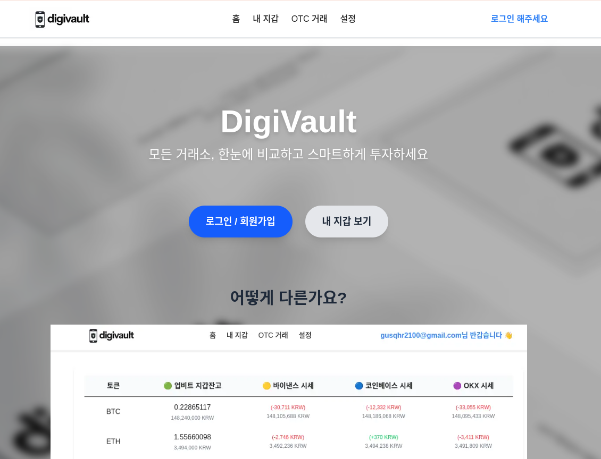
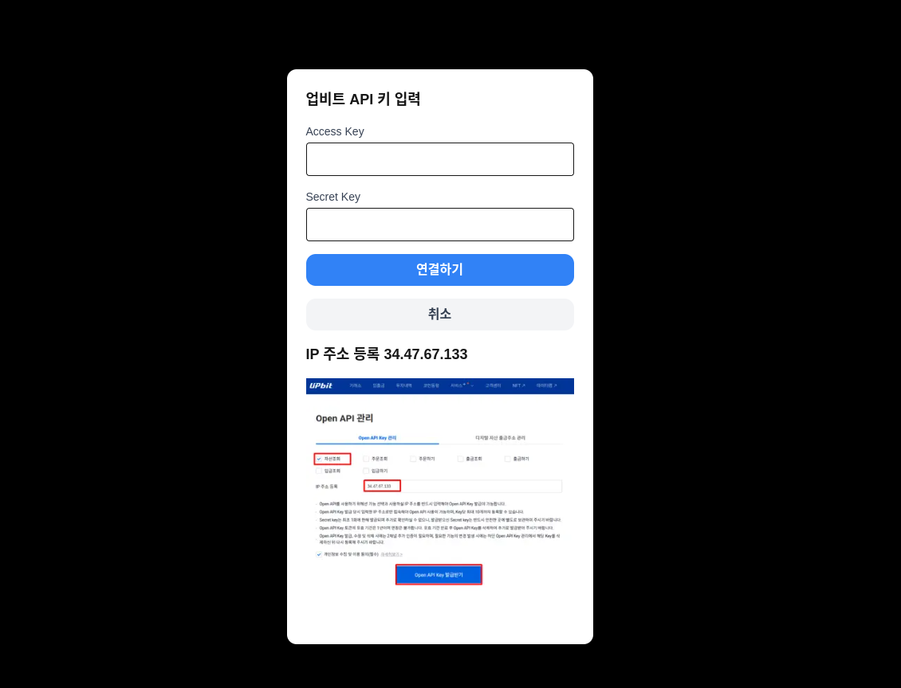
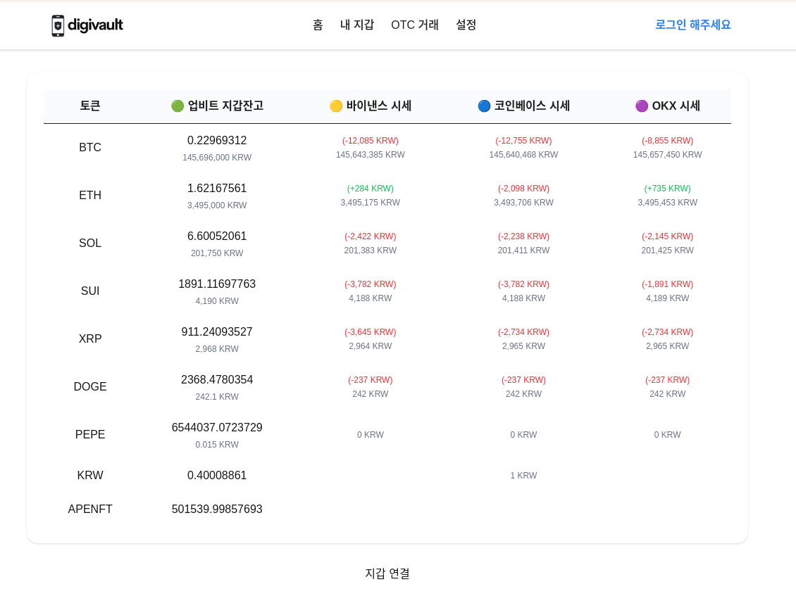

# 🚀 DigiVault — 디지털 자산 보관 및 차익 거래 플랫폼

> 커스터디 서비스와 차익 거래 시세 분석 기능을 통합한 Web3 기반 디지털 자산 플랫폼  
> 업비트 API 연동 및 멀티 거래소 시세 비교를 통해 자금의 동향을 관리하고,  
> GCP 기반의 CI/CD 파이프라인을 통해 운영 안정성을 확보한 프로젝트입니다.
> http://34.64.250.181/

---

##  기술 스택

| 영역 | 스택 |
|------|------|
| **프론트엔드** | `Next.js 15`, `TypeScript 5`, `Tailwind CSS`, `Zustand` |
| **백엔드/API** | `Next.js Route Handlers`, `Supabase`, `PostgreSQL` |
| **지갑 연동** | `wagmi`, `ethers.js`, `viem` |
| **CI/CD** | `GitHub Actions`, `Docker`, `GCP GKE`, `Helm` |
| **테스트** | `Playwright` (예정) |
| **디자인 협업** | `Figma` (예정) |

---

## 주요 기능

| 기능명 | 설명 |
|--------|------|
| 메타마스크 로그인 | `wagmi` 기반의 Web3 로그인 |
| 업비트 자산 연동 | Access/Secret Key 입력 시 실제 잔고 조회 가능 |
| 시세 비교 | 업비트/바이낸스/코인베이스/OKX 가격 비교 후 차익 계산 |
| 차익 실현 포인트 강조 | 거래소별 가격 차이 및 수익 예측 정보 제공 |
| 자산 대시보드 | 보유 자산, 시세, 차익을 테이블 기반으로 통합 시각화 |
| CI/CD 자동 배포 | `GitHub Actions` + `GCP Artifact Registry` + `Helm` 기반 자동화 |
| 보안 고려 | `.env.production` 자동 주입, 키 로컬 보관, CORS 프록시 처리 |

---

# 주요 디버깅
## Helm 에 artifact registry 의 image name, tag 를 맞추지 않아서 GCP kub 에 ImagePullBackOff 에러가 뜨던 이슈
- .github/workflows/deploy.yaml 에 취소선과 name, tag 전역변수로 바꿔서 추가
<pre>      
              - name: Build and Push Docker image to Artifact Registry
        run: |
          IMAGE_REPO="asia-northeast3-docker.pkg.dev/aesthetic-fiber-462503-t5/digivault"
          IMAGE_NAME="digivault-app"
          IMAGE_TAG="$(date +%Y%m%d%H%M%S)"

          FULL_IMAGE_NAME="$IMAGE_REPO/$IMAGE_NAME:$IMAGE_TAG"
          
          docker build --no-cache -t $FULL_IMAGE_NAME . # 빌드 시에도 이 변수 사용
          docker push $FULL_IMAGE_NAME # 푸시 시에도 이 변수 사용
          
          echo "IMAGE_REPO=$IMAGE_REPO" >> $GITHUB_ENV
          echo "IMAGE_NAME=$IMAGE_NAME" >> $GITHUB_ENV
          echo "IMAGE_TAG=$IMAGE_TAG" >> $GITHUB_ENV
          echo "FULL_IMAGE_NAME=$FULL_IMAGE_NAME" >> $GITHUB_ENV

        ...        
        
        - name: Deploy via Helm
        run: |
          helm upgrade --install digivault ./helm/digivault \
          --set image.repository=asia-northeast3-docker.pkg.dev/aesthetic-fiber-462503-t5/digivault \
          --set image.name=digivault-app \
          --set image.tag=$IMAGE_TAG \
          --set image.pullPolicy=Always</pre>
          
- .helm/digivault/value.yaml 에 repository, name, tag 올바르게 받을수 있도록 변경 (tag 는 현재날짜로 설정. 배포시 덮어씌워짐)
<pre>image:
  repository: asia-northeast3-docker.pkg.dev/aesthetic-fiber-462503-t5/digivault
  name: digivault-app
  tag: latest
  pullPolicy: IfNotPresent</pre>

- .github/workflows/template/deployment.yaml imagerepository, name, tag 올바르게 들어가서 artifact registry 에서 잘 가져오도록 변경
<pre>            containers:
        - name: {{ .Chart.Name }}
          securityContext:
            {{- toYaml .Values.securityContext | nindent 12 }}
          image: "{{ .Values.image.repository }}/{{ .Values.image.name }}:{{ .Values.image.tag | default .Chart.AppVersion }}"
          imagePullPolicy: {{ .Values.image.pullPolicy }}</pre>
          
---
  
## frontend 에서 api 로 upbit, binance 값을 조회해 CORS 에러가 나던 이슈
- 브라우저 상에서는 잔액을 조회할 수 없게 공식문서에서 제한한 이슈로 인해 CORS 에러 발생
<pre> 
CORS 에러가 발생합니다
시세 관련 조회 Rest API, Public 타입 WEBSOCKET 요청에 대해 헤더에 Origin이 있을 시 10초당 1회만 요청 가능 합니다.

관련 공지 바로가기
확인방법: 해당 정책은 Remaining-Req 응답 헤더의 group=origin인 경우에 적용됩니다.
Rate Limit에 걸릴 경우 CORS에러가 발생 할 수 있습니다.
브라우저에서 요청이 필요할 경우, 제한에 맞추어 요청해주시거나 별도의 프록시 서버를 구성하여 사용하시기 바랍니다.
</pre>

-  따라서 frontend 에서 API 로 upbit 잔고를 조회할 경우 조회해오지 못하는 문제가 발생
<pre>
        const upbitResponse = await fetch('https://api.upbit.com/v1/ticker?markets=KRW-USDT', {
          headers: {
            'Accept': 'application/json',Add commentMore actions
          },
        })
        if (upbitResponse.ok) {
          const upbitData = await upbitResponse.json()
          if (upbitData && upbitData[0]?.trade_price) {
            usdtKrw = upbitData[0].trade_price
          }
  
</pre>
- /api/upbit-price 로 개선하여 CORS 문제를 해결한 코드
<pre>

import { NextResponse } from 'next/server'

export async function POST(req: Request) {
  try {
    const { symbols } = await req.json()
    
    if (!symbols || !Array.isArray(symbols)) {
      return NextResponse.json({ error: 'Invalid symbols parameter' }, { status: 400 })
    }

    const marketQuery = symbols.map(s => `KRW-${s}`).join(',')
    const response = await fetch(`https://api.upbit.com/v1/ticker?markets=${marketQuery}`, {
      headers: {
        'Accept': 'application/json',
      },
    })

    if (!response.ok) {
      const error = await response.json()
      throw new Error(error.message || '업비트 API 호출 실패')
    }

    const data = await response.json()
    return NextResponse.json(data)
  } catch (error: any) {
    console.error('업비트 시세 조회 에러:', error)
    return NextResponse.json(
      { error: error.message || '업비트 시세 조회 중 오류가 발생했습니다.' },
      { status: 500 }
    )
  }
} </pre>

---
  

## 로그인시 조회되도록 하기 위한 CSR 구조. zustard 를 통한 빠른 잔액조회
- 전역에 createSupabaseClient 를 배치할 경우 DB 연결이 혼재되는 이슈
<pre>
const supabase = createSupabaseClient()
  
export async function signUpWithEmail(email: string, password: string) {Add commentMore actions
  const password_hash = await bcrypt.hash(password, 10)

  const { data, error } = await supabase.from('users').insert([
    {
      email,
      password_hash,
    },
  ])

  if (error) throw error
  return data
}</pre>
- CSR 기반으로 createSupabaseClient 를 함으로써 로그인시 쿠키/세션 을 공유받아 출력
<pre>// 로그인
export async function loginWithEmail(email: string, password: string) {
  const supabase = createSupabaseClient()
  const { data, error } = await supabase
    .from('users')
    .select('id, password_hash')
    .eq('email', email)
    .single()

  if (error || !data) throw new Error('유저 없음 또는 쿼리 실패')

  const isValid = await bcrypt.compare(password, data.password_hash)
  if (!isValid) throw new Error('❌ 비밀번호 틀림')

  useAuthStore.getState().setEmail(email)

  return data // 로그인 성공 시 사용자 정보 리턴
}</pre>
- 조회가 많이 되는 잔고 데이터를 zustard 에 배치해 
<pre>type WalletState = {
  ethBalance: string
  tokenBalances: TokenBalance[]
  setEthBalance: (bal: string) => void
  setTokenBalances: (tokens: TokenBalance[]) => void
  upbitAccessKey?: string
  upbitSecretKey?: string
  setUpbitKeys?: (accessKey: string, secretKey: string) => void
}

export const useWalletStore = create(
  persist<WalletState>(
    (set) => ({
      ethBalance: '',
      tokenBalances: [],
      setEthBalance: (bal) => set({ ethBalance: bal }),
      setTokenBalances: (tokens) => set({ tokenBalances: tokens }),
      upbitAccessKey: '',
      upbitSecretKey: '',
      setUpbitKeys: (accessKey, secretKey) => set({ upbitAccessKey: accessKey, upbitSecretKey: secretKey }),
    }),
    {
      name: 'wallet-storage',
      storage: createJSONStorage(() => localStorage),
    }
  )
)</pre>

---

## 보안 설계 고려

- Supabase env 자동 주입 (`NEXT_PUBLIC_...` secret → `.env.production`)
- 외부 API (Upbit, Binance 등) 프록시 처리 → CORS 우회
- 업비트 Secret Key는 상태만 zustard에 저장하고, Supabase에 직접 저장하지 않음
- GCP IAM 권한 최소화된 SA만 GitHub Actions에서 사용
- CI/CD시 이미지 태그를 `date +%Y%m%d%H%M%S`로 버전 관리

---

## CI/CD 배포 구조

| 단계 | 설명 |
|------|------|
| **빌드** | GitHub Actions에서 Docker Image 빌드 후 GCP Artifact Registry에 푸시 |
| **배포** | Helm Chart를 통해 GKE에 자동 배포 (버전 태그 기반) |
| **DNS** | 가비아 도메인 → LoadBalancer IP 연결 (A 레코드) |
| **확인** | `https://yourdomain.com`으로 접근해 자산 확인 가능 |

---

## 향후 발전 방향

- [ ] **JWT 기반 세션 관리 및 SSO 연동**
- [ ] **다중 지갑(Naver, Kaikas 등) 연동**
- [ ] **한국 거래소 비교 기능 추가**
- [ ] **차익상황 시 API 를 통한 송금기능 추가 (미정)**
